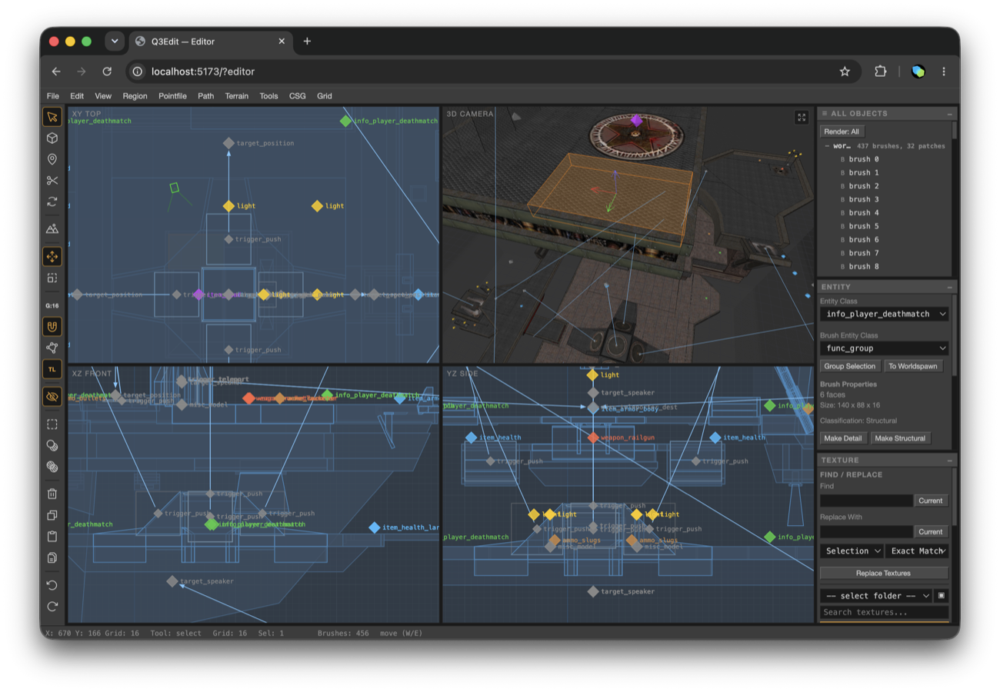

# Q3Edit

Q3Edit is a work-in-progress Quake III Arena map editor that runs entirely in
the browser with WebGL2. It supports editing `.map` files, brush and patch
geometry, entities, textures, terrain, and client-side BSP compilation.

[Open Q3Edit](https://q3edit.com)



## Features

- Four Radiant-style 2D and 3D editing viewports
- Brush, patch, clipping, CSG, vertex, terrain, and transform tools
- Entity editing and target/path visualization
- Local `.map` file loading and saving
- Browser-local PK3 management with ordering and enable/disable controls
- OpenArena textures by default, with optional retail Quake III PK3 files
- q3map and BSPC compiled to WebAssembly for client-side BSP, VIS, light, and bot-navigation stages
- ioquake3 compiled to WebAssembly for playing compiled maps in the editor
- Remembered Quick Play options cover compile quality, up to three bots, and bot skill

Q3Edit is under active development. Save important work frequently and keep
copies of your source `.map` files.

## Development

Requirements:

- Node.js 22 or newer
- A modern browser with WebGL2
- `curl`, `unzip`, `zip`, and `shasum` to prepare OpenArena assets
- Git, CMake, and Emscripten 5.0.3 to build the WebAssembly tools

Install dependencies and prepare the default OpenArena assets:

```sh
npm ci
npm run assets:openarena
```

Start the Vite development server:

```sh
npm run dev
```

For experimental live map editing from Claude Code or Codex, see [Live MCP bridge](docs/LIVE_MCP.md).

The OpenArena PK3 files are generated under `public/openarena/` and ignored by
Git. Retail Quake III PK3 files are never part of the repository: users select
them from the editor, and Q3Edit stores them only in that browser.

## Builds

Build the TypeScript/Vite application:

```sh
npm run build
```

Build a complete deployable `dist/`, including q3map and BSPC JavaScript and WebAssembly:

```sh
npm run build:release
```

The q3map port and its provenance are documented in
[`q3map-compiler/README.md`](q3map-compiler/README.md).
The BSP-to-AAS bot-navigation port is documented in
[`bspc-compiler/README.md`](bspc-compiler/README.md).
The browser player uses a pinned, unmodified ioquake3 revision. Build and
source details are documented in [`public/ioquake3/SOURCE.md`](public/ioquake3/SOURCE.md).

To build only the browser ioquake3 runtime for local development:

```sh
npm run build:ioq3
```

## AWS deployment

The repository includes an [AWS CloudFormation template](infra/aws/cloudformation.yaml)
for a private S3 bucket, CloudFront, ACM, and Route 53. The
[deploy script](infra/aws/deploy.sh) derives the bucket from the active AWS
account and discovers the CloudFront distribution by domain alias.

```sh
AWS_PROFILE=your-profile npm run deploy
```

The following environment variables override discovery when needed:

- `Q3EDIT_DOMAIN` (default: `q3edit.com`)
- `Q3EDIT_S3_BUCKET`
- `Q3EDIT_CLOUDFRONT_DISTRIBUTION_ID`

The deploy script requires the generated OpenArena archives and runs the full
release build before uploading.

## Licensing and game data

Q3Edit is licensed under GPL-2.0-or-later. See [`LICENSE`](LICENSE) and
[`THIRD_PARTY_NOTICES.md`](THIRD_PARTY_NOTICES.md).

The q3map compiler is derived from id Software's GPL source release, and the
browser player is built from ioquake3's GPL source. Quake III Arena retail game
data is not included. OpenArena default content is prepared from the upstream
OpenArena 0.8.8 release; its source and license information are in
[`public/openarena/OPENARENA.md`](public/openarena/OPENARENA.md).

Q3Edit is an independent community project and is not affiliated with or
endorsed by id Software or Bethesda Softworks.
